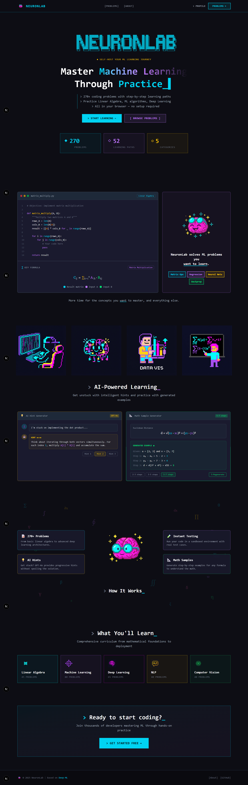
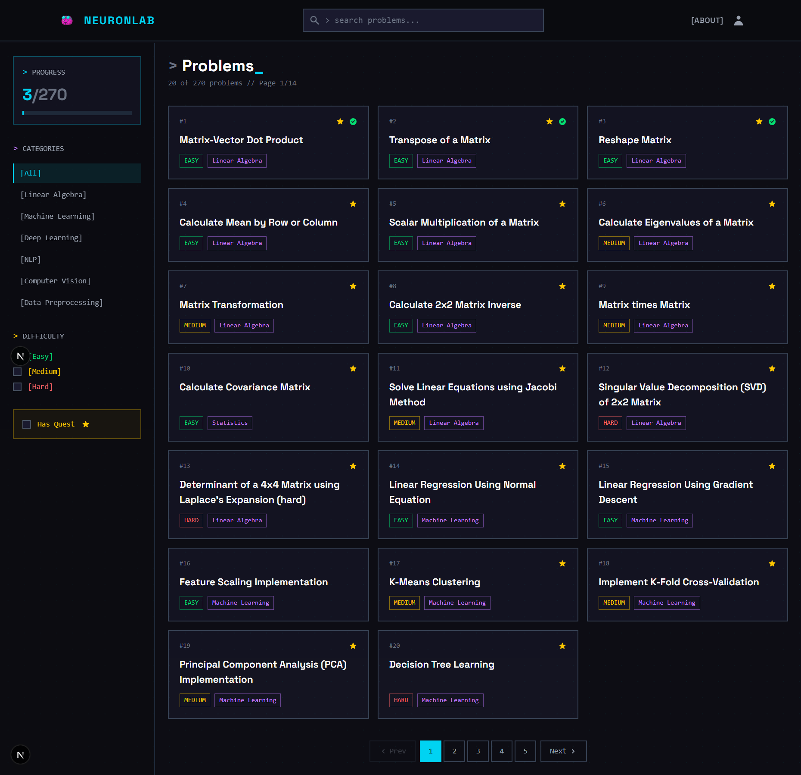
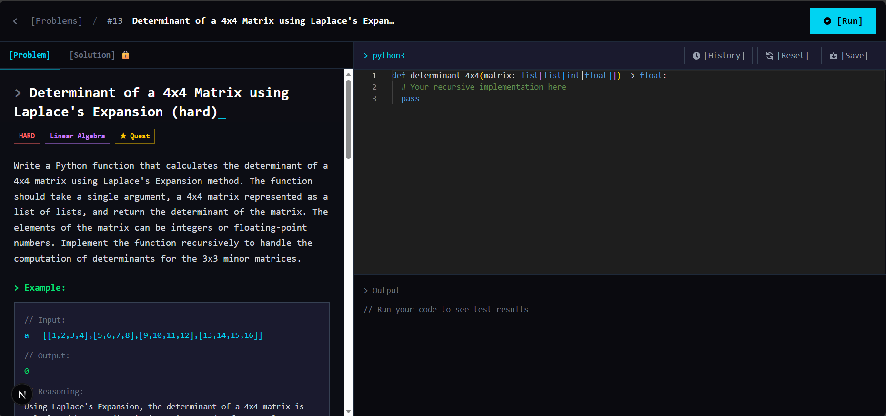
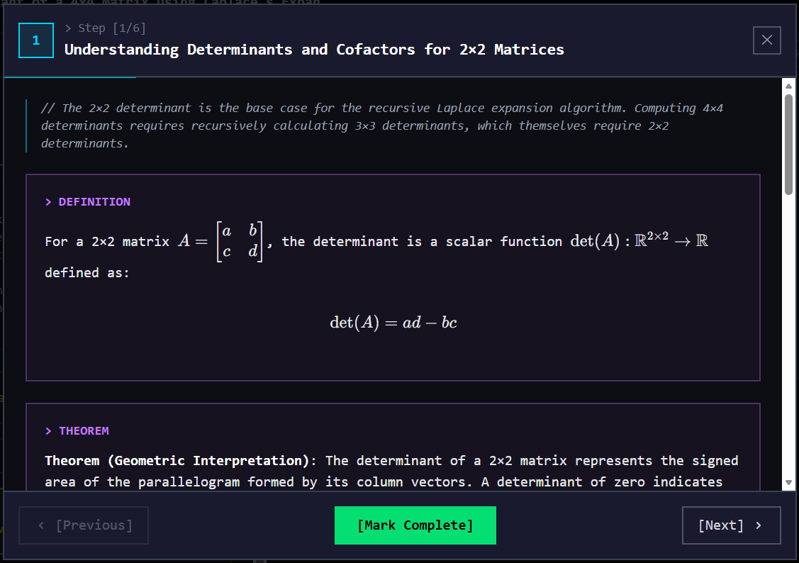
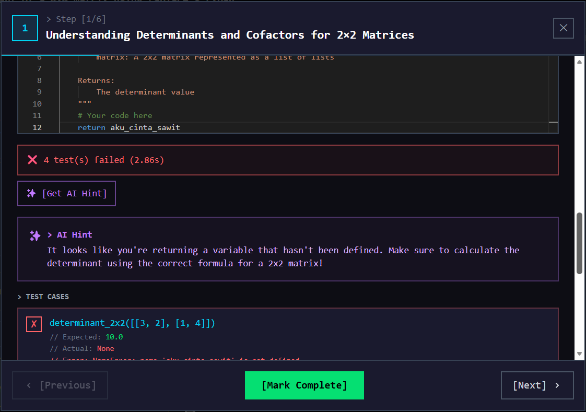
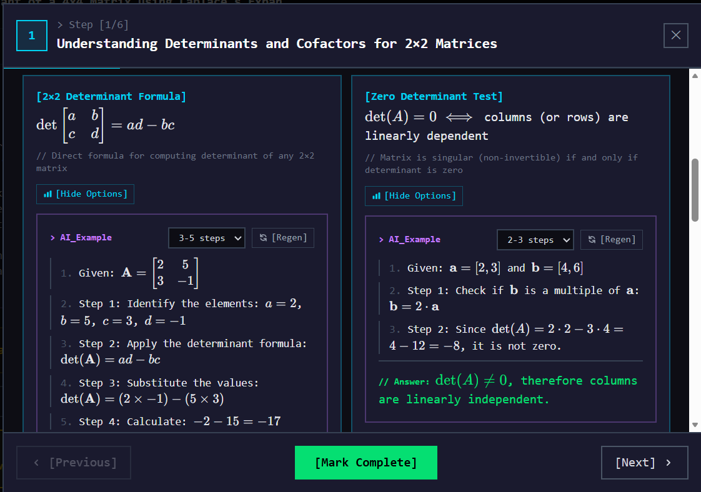
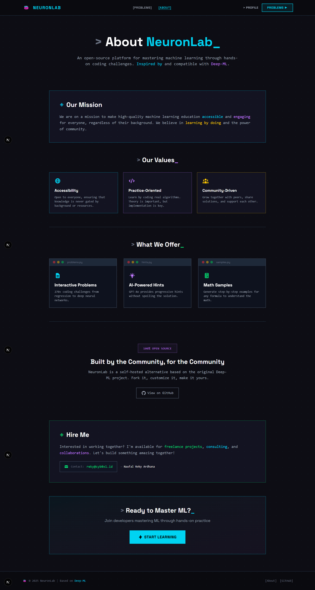

# NeuronLab Frontend

A modern web-based machine learning practice platform for mastering ML/AI concepts through interactive coding exercises. Built as a self-hosted alternative inspired by [Deep-ML](https://deep-ml.com).



## Features

### Problem Library
Browse 270+ ML/AI coding problems with filtering by category and difficulty. Problems cover Linear Algebra, Machine Learning, Deep Learning, NLP, and Computer Vision.



### Interactive Code Editor
Write and execute Python code directly in your browser with Monaco Editor. Get instant feedback with test case validation.



### Guided Learning Quests (Side Quests)
Step-by-step learning modules with mathematical definitions, theorems, and practice exercises. Master concepts before tackling problems.



### AI-Powered Hints
Get intelligent, progressive hints using GPT-4o when you're stuck on a problem. Hints guide you without spoiling the solution.



### Math Sample Generator
Generate worked mathematical examples with selectable complexity (2-3, 3-5, or 5-7 steps). Understand formulas through concrete examples.



### About Page
Learn about the platform, its mission, values, and get in touch for collaborations or freelance work.



### User Profiles
Track your progress, submission history, and success rates across all problem categories.

## Tech Stack

- **Framework**: Next.js 15 (App Router)
- **Language**: TypeScript
- **Styling**: Tailwind CSS
- **Code Editor**: Monaco Editor
- **Math Rendering**: KaTeX
- **Icons**: React Icons

## Getting Started

### Prerequisites

- Node.js 18+
- npm or yarn

### Installation

```bash
# Clone the repository
git clone https://github.com/neuronlab-id/frontend.git
cd frontend

# Install dependencies
npm install

# Start development server
npm run dev
```

Open [http://localhost:3000](http://localhost:3000) to view the app.

### Environment Variables

Create a `.env.local` file:

```env
NEXT_PUBLIC_API_URL=http://localhost:8000
```

## Project Structure

```
src/
├── app/                    # Next.js App Router pages
│   ├── login/             # Authentication (Sign In / Sign Up)
│   ├── problems/          # Problem listing with filters
│   ├── problem/[id]/      # Problem detail with code editor
│   ├── profile/           # User profile and stats
│   ├── settings/          # User settings
│   └── about/             # About page
├── components/            # Reusable components
│   ├── MathRenderer.tsx   # LaTeX math rendering
│   ├── MathSampleGenerator.tsx  # AI math examples
│   ├── SideQuestModal.tsx # Quest learning modal
│   ├── AuthNavButtons.tsx # Authentication navigation
│   └── TestResultsPanel.tsx
├── lib/
│   └── api.ts            # API client
└── types/
    └── index.ts          # TypeScript types
```

## Authentication

The app uses JWT-based authentication:
- Register with username, email, and password
- Login to access code execution and submissions
- Token stored in localStorage and cookies
- Persistent sessions across browser refreshes

## API Integration

The frontend connects to a FastAPI backend. Key endpoints:

| Endpoint | Description |
|----------|-------------|
| `POST /api/auth/login` | User login |
| `POST /api/auth/register` | User registration |
| `GET /api/problems` | List problems with filters |
| `GET /api/problems/:id` | Problem details |
| `POST /api/execute` | Run code in sandbox |
| `POST /api/submit` | Submit solution |
| `POST /api/generate-sample` | AI math sample generation |
| `POST /api/generate-hint` | AI hint generation |

## Scripts

```bash
npm run dev      # Start development server
npm run build    # Build for production
npm run start    # Start production server
npm run lint     # Run ESLint
```

## Screenshots

| Landing Page | Problems |
|--------------|----------|
|  |  |

| Problem Detail | Side Quest |
|----------------|------------|
|  |  |

| AI Hints | Math Samples |
|----------|--------------|
|  |  |

## Contributing

Contributions are welcome. Please open an issue or submit a pull request.

## License

MIT

## Contact

Created by **Naufal Reky Ardhana** - [reky@cyb0x1.id](mailto:reky@cyb0x1.id)

GitHub: [github.com/neuronlab-id](https://github.com/neuronlab-id)
